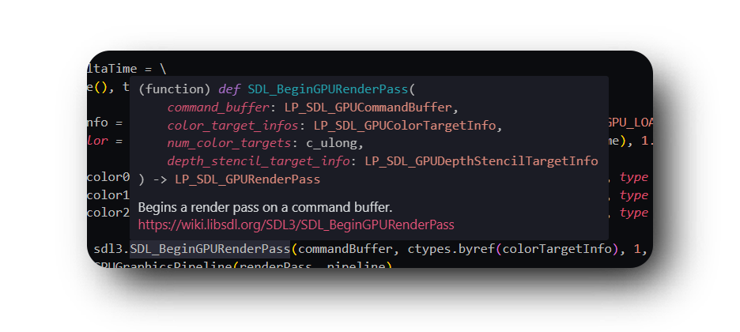

PySDL3 Documentation
====================
PySDL3 is a pure Python wrapper around the SDL3, SDL3_image, SDL3_mixer, SDL3_ttf, SDL3_rtf, SDL3_net and SDL3_shadercross libraries.
It uses the built-in ctypes library to interface with SDL3 while providing an **understandable** function definition with docstrings, argument names and type hints, like this:

Getting Started
===============

.. toctree::
  :maxdepth: 3

  install.rst

API Reference
=============

.. toctree::
  :maxdepth: 2

  modules/index.rst